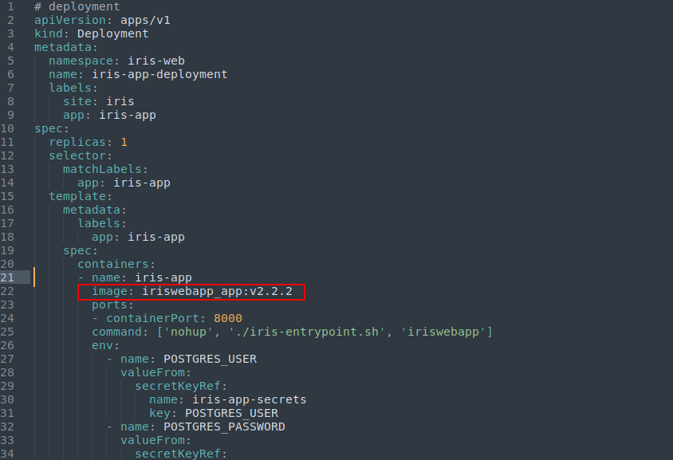
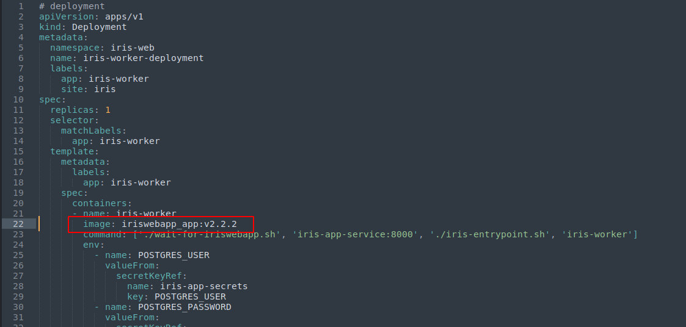
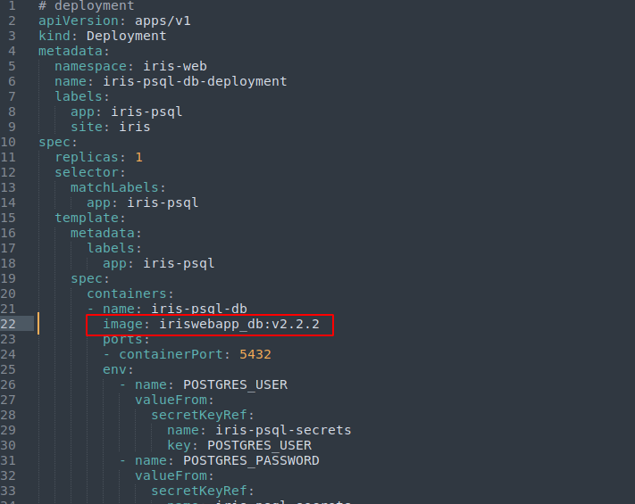
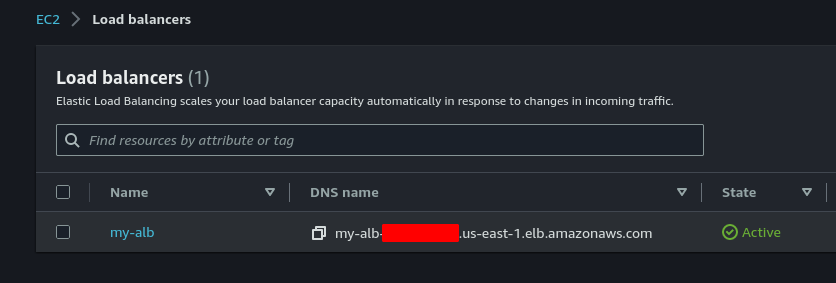

# The Iris EKS manifest to deploy Iris-web on AWS EKS.

Description:
  - This manifest file will help to deploy the application on the AWS EKS.

## Prerequisites;
 - Install AWS ebs CSI driver. (terraform example [here](https://github.com/s3lva-kumar/terraform-eks-plugin/tree/master/terraform-amazon-ebs-csi-driver))
 - Install AWS alb ingress controler (terraform example [here](https://github.com/s3lva-kumar/terraform-eks-plugin/tree/master/terraform-amazon-alb-ingress))

## Deploy:
 - Clone this Repository
      ``` bash   
        $ git clone https://github.com/dfir-iris/iris-web.git
      ```
 - Before we deploy the manifeat, we need to update the Docker image on our manifest.
 - ### update app image:
    - Naviaget to the deploy/eks_manifest/app directory.
    - open the *deployment.yml* file and update the image
    
- ### update worker image:
    - Naviaget to the deploy/eks_manifest/worker directory.
    - open the *deployment.yml* file and update the image
    

- ### update db image:
    - Naviaget to the deploy/eks_manifest/psql directory.
    - open the *deployment.yml* file and update the image
    

- ### update the SSL and domain name on app ingress YAML file
    - Naviaget to the deploy/eks_manifest/app directory.
    - open the *ingress.yml* file and update the SSL and host
    
    - *Note:*
      - SSL : 
        Give a ACM certificate ARN.
      - HOST : 
         Give the host name whatever you want. In additionally, once the ingress created it will be provisioned the ALB on AWS with this name "iris-alb". Then, configure the DNS 'CNAME' record with hostname *(which you given on ingress file)* point to the AWS alb 'DNS'
         

- once updated the all the things which is mentioned above, then run the **Makefile**
    - Navigate to the *deploy/eks_manifest*, here you can see the 'Makefile'
    - To deploy app, run 
      ``` bash 
        $ make
        $ make create
         ```
    - To delete app, run
      
      *caution: it will be delete all things exclude DB*
      ``` bash
        $ make
        $ make delete
      ```